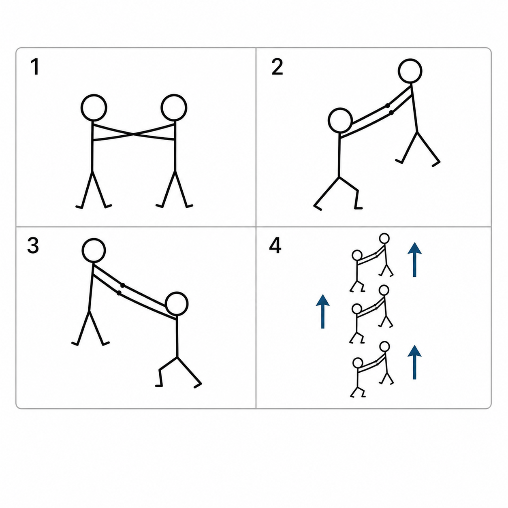
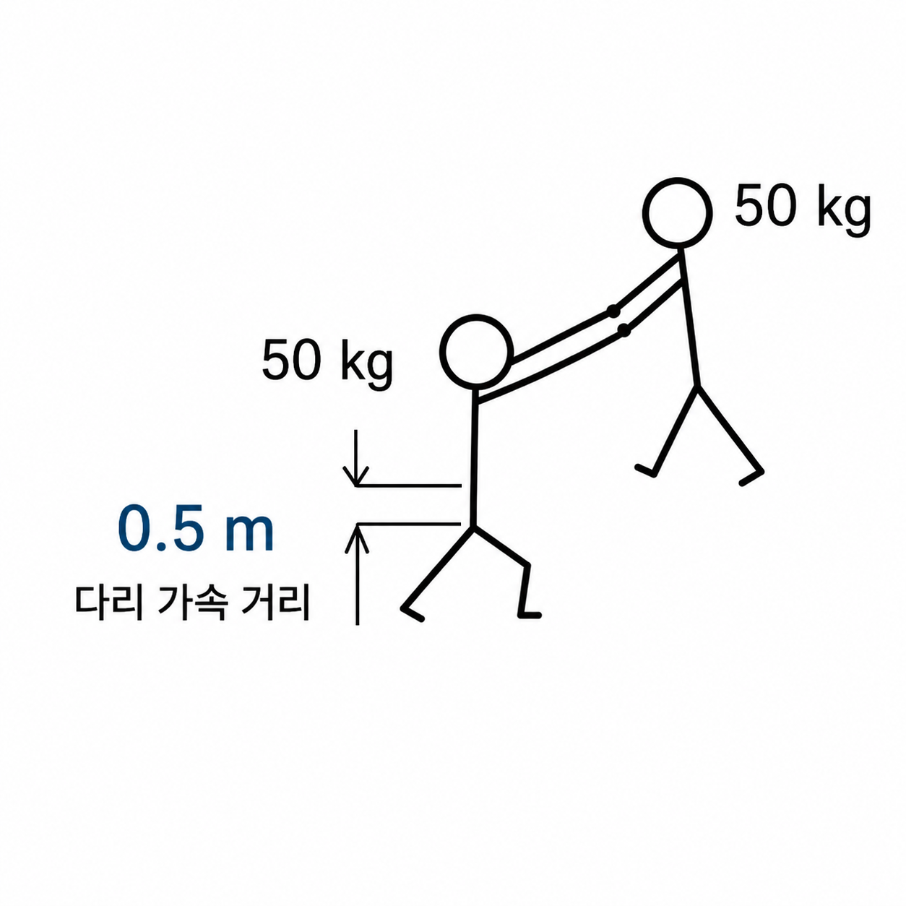

두 사람이 서로를 붙잡고 번갈아 들어 올리면 계속 위로 올라갈 수 있다는 밈이 있다.

1. 친구와 서로 붙잡는다.
2. 친구를 들어 올린다.
3. 떨어지기 전에 친구가 나를 들어 올린다.
4. 팀워크를 통해 하늘을 난다.

실제로는 공중에서 서로를 당기는 힘이 두 사람 사이의 내부 힘이기 때문에 두 사람 전체의 무게중심은 올라가지 않는다. 한 사람이 올라가면 그만큼 다른 사람이 내려갈 뿐이다.

그렇다면 서로 들어 올리는 과정은 포기하고, 두 사람이 처음 점프할 때부터 비둘기가 날아다닐 법한 높이인 **100m**까지 올라갈 속도를 얻는다고 가정하면 어떨까?

사람 한 명의 몸무게를 50kg, 두 명의 총질량을 100kg으로 두고 계산해 보자. 점프할 때 무릎을 굽혔다가 다리를 완전히 펴는 동안 몸의 무게중심이 움직이는 거리는 약 0.5m라고 가정한다.

## 100m까지 올라가기 위한 속도

공기저항을 무시하면 물체가 수직으로 100m 상승하기 위해 필요한 초기속도는 다음과 같다.

$$
v=\sqrt{2gh}
$$

여기에 중력가속도 \(g=9.81\,\mathrm{m/s^2}\), 높이 \(h=100\,\mathrm{m}\)를 넣으면

$$
\begin{aligned}
v &= \sqrt{2\times9.81\times100} \\
  &\approx 44.3\,\mathrm{m/s}
\end{aligned}
$$

즉 두 사람은 지면을 떠나는 순간 위쪽으로 약 **44.3m/s**, 시속으로는 약 **159km/h**로 움직여야 한다. 사람이 달리는 속도와 비교할 수준이 아니라, 자동차가 고속도로에서 달리는 속도로 수직 발사되는 셈이다.

## 다리를 펴는 거리는 약 0.5m

정지 상태에서 0.5m 동안 가속해 44.3m/s에 도달하려면 등가속도 공식

$$
v^2=2as
$$

을 사용할 수 있다.

$$
\begin{aligned}
a &= \frac{v^2}{2s} \\
  &= \frac{44.3^2}{2\times0.5} \\
  &\approx 1{,}962\,\mathrm{m/s^2}
\end{aligned}
$$

이는 중력가속도의 약

$$
\frac{1{,}962}{9.81}\approx200
$$

배다. 즉 점프하는 짧은 순간 동안 두 사람의 몸은 약 **200g**의 가속도를 받아야 한다.

## 필요한 다리 힘

두 사람의 총질량은 100kg이다. 지면이 사람을 밀어 올리는 힘은 위쪽 가속에 필요한 힘뿐 아니라 중력까지 버텨야 하므로 다음과 같다.

$$
F=M(a+g)
$$

$$
\begin{aligned}
F &= 100\times(1{,}962+9.81) \\
  &\approx197{,}000\,\mathrm{N}
\end{aligned}
$$

약 **197kN**이다. 이를 익숙한 무게 단위로 환산하면

$$
\frac{197{,}000}{9.81}
\approx20{,}100\,\mathrm{kgf}
$$

대략 **20톤중**이다.

아래쪽 사람이 두 사람을 함께 점프시키려면 다리로 평균 약 20톤을 밀어내야 한다. 실제 점프에서는 힘이 일정하게 유지되지 않으므로 순간 최대 힘은 이것보다 더 클 수 있다. 위쪽 50kg 사람을 붙잡고 있는 팔이나 연결 장치에도 약 절반인 **10톤중** 정도의 힘이 전달된다.

## 시간은 약 0.02초

44.3m/s까지 가속하는 데 필요한 시간은

$$
\begin{aligned}
t &= \frac{v}{a} \\
  &= \frac{44.3}{1{,}962} \\
  &\approx0.0226\,\mathrm{s}
\end{aligned}
$$

약 **0.023초**다.

눈을 한 번 깜빡이는 시간이 대략 0.1초 정도이므로, 그보다 훨씬 짧은 시간 안에 20톤의 힘을 받아 시속 159km까지 가속해야 한다.

## 필요한 에너지는 의외로 크지 않다

두 사람을 100m 높이까지 올리는 데 필요한 위치에너지는

$$
E=Mgh
$$

$$
\begin{aligned}
E &= 100\times9.81\times100 \\
  &= 98{,}100\,\mathrm{J}
\end{aligned}
$$

약 **98kJ**다.

에너지의 양만 보면 기계장치로 저장하거나 방출하는 것이 완전히 불가능한 규모는 아니다. 문제는 이 에너지를 사람의 다리 길이에 해당하는 0.5m 안에서 약 0.023초 만에 전달해야 한다는 점이다.

평균 출력은 대략

$$
\begin{aligned}
P &= \frac{E}{t} \\
  &= \frac{98{,}100}{0.0226} \\
  &\approx4.3\,\mathrm{MW}
\end{aligned}
$$

약 **4.3MW**다. 잠깐이지만 대형 발전기 수준의 출력을 사람 몸에 전달해야 한다.

## 거대한 스프링을 사용한다면

단순화해서 0.5m 압축된 스프링에 98kJ를 저장한다고 가정하면

$$
E=\frac{1}{2}kx^2
$$

이므로 스프링 상수는

$$
\begin{aligned}
k &= \frac{2E}{x^2} \\
  &= \frac{2\times98{,}100}{0.5^2} \\
  &\approx785{,}000\,\mathrm{N/m}
\end{aligned}
$$

이 된다.

스프링을 0.5m 압축했을 때의 최대 힘은

$$
\begin{aligned}
F_{\max} &= kx \\
         &\approx392{,}000\,\mathrm{N}
\end{aligned}
$$

약 **40톤중**이다.

에너지를 저장한 고탄성 스프링이나 폭발식 엑소스켈레톤을 사용하면 기계적으로 발사 자체는 가능할 수 있다. 다만 사람의 다리와 척추가 수십 톤의 힘과 200g의 가속도를 견딜 가능성은 거의 없다.

## 서로 번갈아 들어 올리는 것은 의미가 없다

공중에 뜬 뒤 두 사람이 서로를 들어 올리면 한 사람이 올라가는 만큼 다른 사람이 내려간다. 두 사람 사이에서 아무리 큰 힘을 주고받더라도 외부에서 추가적인 힘이 작용하지 않는 이상 전체 무게중심은 변하지 않는다.

따라서 100m까지 올라가려면 처음 지면을 박차는 순간 이미 필요한 속도와 에너지를 모두 얻어야 한다. 결국 이 밈을 실제 물리현상으로 만들려면 두 사람이 협동해서 하늘을 나는 것이 아니라, 한 사람이 다른 사람을 붙잡은 채 **20톤짜리 점프 장치로 수직 발사되는 것**에 가깝다.

상승에 성공하더라도 약 4.5초 뒤에는 다시 떨어지기 시작한다. 별도의 낙하산이나 감속 장치가 없다면 지면 근처에서 다시 시속 159km에 가까운 속도가 된다.

기계적으로만 보면 완전히 불가능한 에너지 규모는 아니지만, 인간이 살아 있지는 않을 가능성이 높다.
